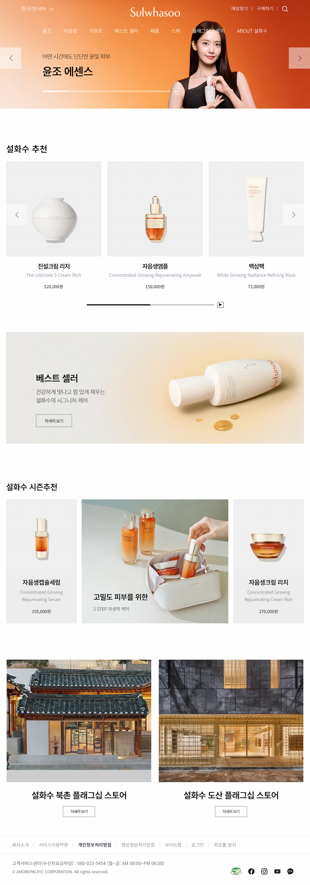
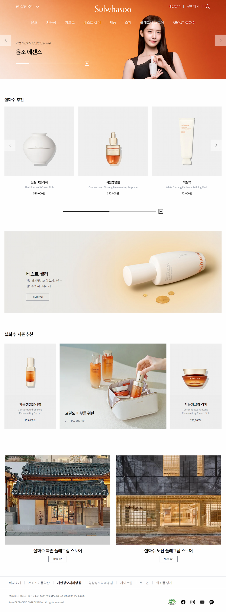
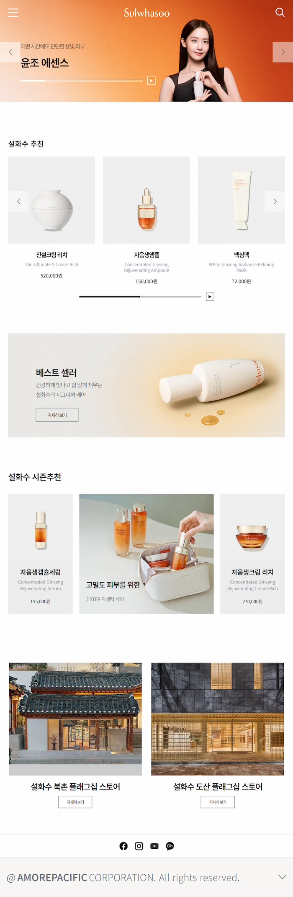
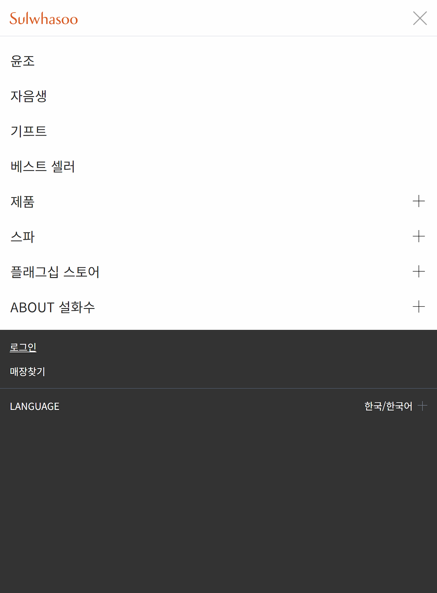

# 프로젝트 이름

설화수 공식 홈페이지 메인 페이지 반응형 클론코딩 프로젝트입니다. <br>
🔗 배포 주소: https://yona0625.github.io/project-sulwhasoo/

## 기획 의도

테일윈드 CSS를 새로 학습하며, 레이아웃 감각과 구조를 익히기 좋은 사이트를 클론코딩 대상으로 찾았습니다. 설화수 홈페이지는 넉넉한 여백과 큰 이미지 위주의 구성이라 이에 적합하다고 판단했습니다.

## 주요 기능

- 반응형 Header (PC 드롭다운, 모바일 사이드바 아코디언)
- 검색창 열기/닫기와 딤드 처리
- Swiper를 활용한 메인/추천 슬라이드 (자동재생, 페이지네이션, 텍스트 애니메이션)
- 스크롤 반영 Top 버튼
- 아코디언 형식의 Footer (정책 링크 및 고객센터 정보)

## 디자인 분석

- 넉넉한 여백과 히어로 섹션, 상품 이미지 중심의 레이아웃
- 고급스럽고 차분한 분위기의 색감과 비주얼 이미지
- 4단 분기점(320 모바일 / 721 태블릿 / 1024 PC / 1025 와이드)으로 디테일하게 구성된 반응형 구조

## 사용 기술

- HTML5
- JavaScript (ES6+, Vanilla)
- Tailwind CSS: 처음 학습하며 적용
- Swiper.js: 슬라이드 및 자동재생, 페이지네이션 구현을 위해 사용

## 미리 보기(스크린샷)

### [전 분기점] - 총 4페이지 (1025 와이드 / 1024 PC / 721 타블렛 / 320 모바일) <br>

<table>
<tr>
    <td valign="top"></td>
    <td valign="top"></td>
  </tr>
  <tr>
    <td valign="top"></td>
    <td valign="top"></td>
  </tr>
</table>

### [기타 화면] <br>

### (PC/타블렛의 검색창 화면, 타블렛 사이드바 화면)

<table>
  <tr>
    <td valign="top"></td>
    <td valign="top"></td>
  </tr>
  <tr>
    <td valign="top"></td>
  </tr>
</table>

## 개발 기간

- 2026년 3월 ~ 2026년 4월

## 어려웠던 점 & 해결 과정

- **아코디언 높이 충돌** <br>
  문제: min-height가 우선순위상 max-height보다 앞서 적용되어, JS로 max-height를 0으로 복원해도 min-height 값이 유지되며 펼쳐진 상태로 남는 문제 <br>
  해결: JS에서 min-height와 max-height를 동시에 명시적으로 제거하도록 처리하여 해결
  <br><br>

- **딤드 hidden/block 충돌** <br>
  문제: Tailwind CSS의 hidden(!important)이 다른 커스텀 클래스보다 항상 우선 적용되어, active 클래스를 추가해도 block으로 전환되지 않는 문제 <br>
  해결: block(또는 flex)과 hidden을 HTML에 함께 선언해두고, JS에서 hidden 클래스만 토글하는 방식으로 우선순위 충돌 자체를 피하여 해결
  <br><br>

- **헤더 배경색 타이밍 충돌** <br>
  문제: 검색창을 닫는 동작과 헤더 배경색이 빠지는 동작을 동시에 처리하려다 배경색이 빠지지 않거나 타이밍이 꼬이는 문제 <br>
  해결: "색이 들어가는 조건"(검색창 열기)과 "색이 빠지는 조건"(헤더 영역을 완전히 벗어나는 클릭)을 서로 다른 트리거로 분리해 해결

## 파일 구조

```
clonecoding/
├── dist/
│   └── output.css
├── public/
│   └── images/
│       ├── docs/
│       ├── common/
│       ├── layout/
│       └── main/
├── src/
│   ├── input.css
│   └── js/
│       ├── main.js
│       └── swiper.js
├── index.html
├── package-lock.json
├── package.json
├── prettier.config.js
└── tailwind.config.js
```

## 실행 방법

```bash
npm install
npm run dev
```

이후 `index.html`을 브라우저(또는 Live Server)로 열어 확인할 수 있습니다.
